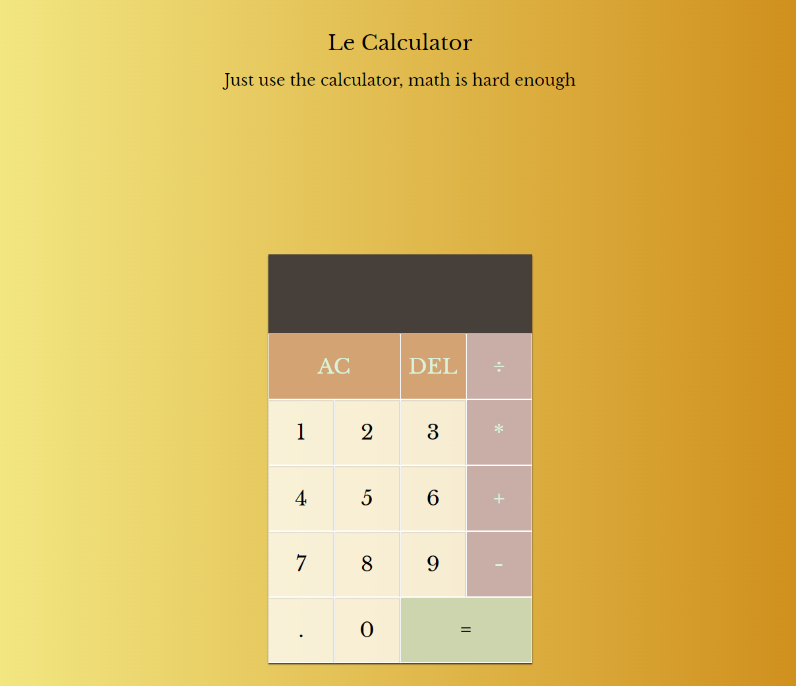

# Art Gallery Redesign

## Table of contents

- [Overview](#overview)
  - [The challenge](#the-challenge)
  - [Screenshot](#screenshot)
  - [Links](#links)
- [My process](#my-process)
  - [Built with](#built-with)
  - [What I learned](#what-i-learned)
  - [Continued development](#continued-development)
  - [Useful resources](#useful-resources)

## Overview
Created a functional calculator using JavaScript

### The challenge

Users should be able to:

-	Use the calculator to solve mathematical equations that involve adding, subtracting, dividing,  and multiplying. 
-	Press the AC (All Clear) button to clear the numbers currently on display

### Screenshot

### Links

- Solution URL: 
- Live Site URL: 

## My process
-	I followed along with the Web Dev Simplified tutorial to layout out my html and css. 
-	I added my own design elements such as shadows, new fonts and color style choices as well as an inverse shadow to make my buttons look like they were being pressed. 
-	Then we set up the JavaScript file by setting up our variables and creating classes to store the numbers that would be used. 
-	I had to define the functions that the calculator could do (clear numbers, add, multiply, etc) by creating a calculator variable that would update those functions. 
-	All the while working on getting JS to properly append numbers together and then implementing compute, clear and delete. 
-	I paused frequently to test my code along the way on my live server

### Built with

- HTML
- CSS Grid
- Javascript

### What I learned

-	This was another great practice at using JavaScript, I learned about how to set up functions for mathematical equations and rewrite my code to make corrects. For example letting JS know how to properly append numbers (1+1 = 2 instead of combining them into 1+1 = 11).  

### Continued development
-	I plan on taking more JS courses and watching several other tutorials. My goal is to not only revisit this practice and look at it from a more developed eye, but also try it completely on my own without the tutorial.   

### Useful resources

- The Web Simplified Youtube tutorial- https://www.youtube.com/watch?v=j59qQ7YWLxw
- w3schools

